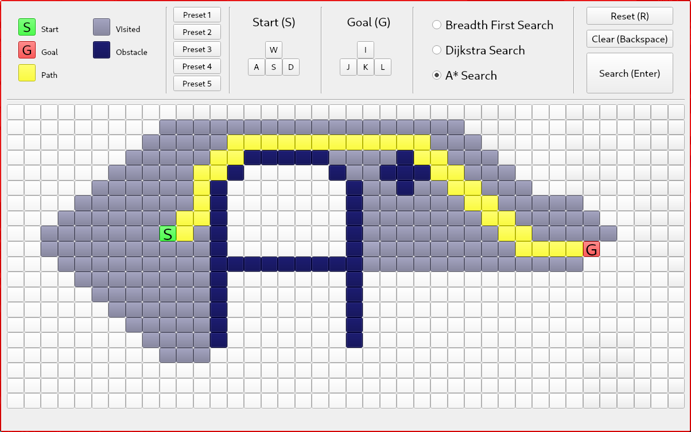

# Shortest-Path

This is my attempt to implement a GUI in C++ to find the shortest path in a two-dimensional field.

Regarding the logic I followed this [guide](https://www.redblobgames.com/pathfinding/a-star/introduction.html) very closely and implemented the GUI using the Qt framework.

## Dependencies for Running Locally
* cmake >= 3.5
* make >= 4.1 (Linux)
  * Linux: make is installed by default on most Linux distros
* gcc/g++ >= 8.0
  * Linux: gcc / g++ is installed by default on most Linux distros
* qt5. On Ubuntu install via:
  * `sudo apt-get install qt5-default`

## Basic Build Instructions

1. Clone this repo.
2. Make a build directory in the top level directory: `mkdir build && cd build`
3. Compile: `cmake .. && make`
4. Run it: `./Shortest-Path`

## Usage
###TODO...
